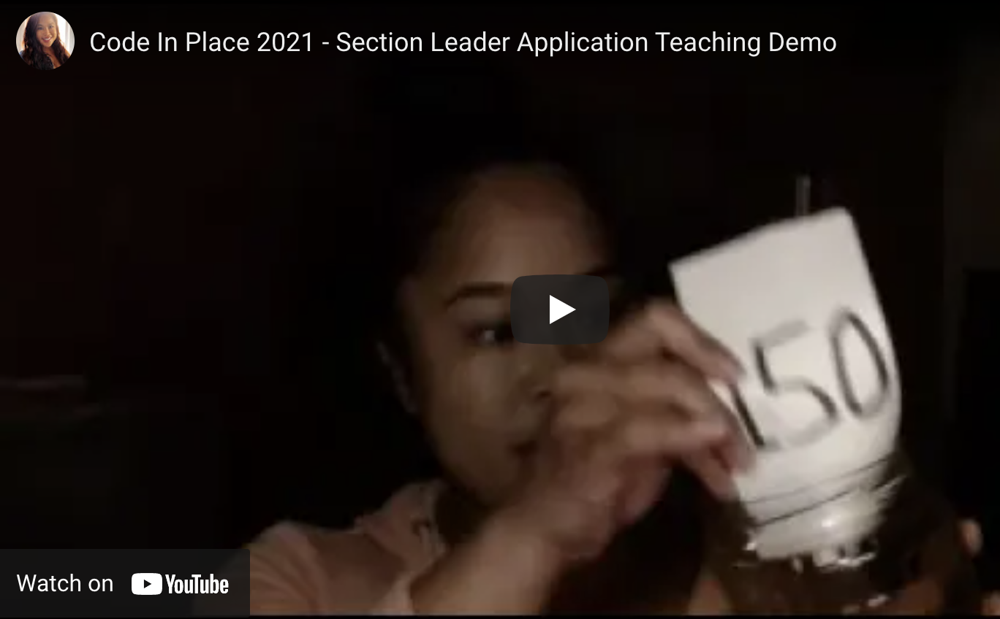
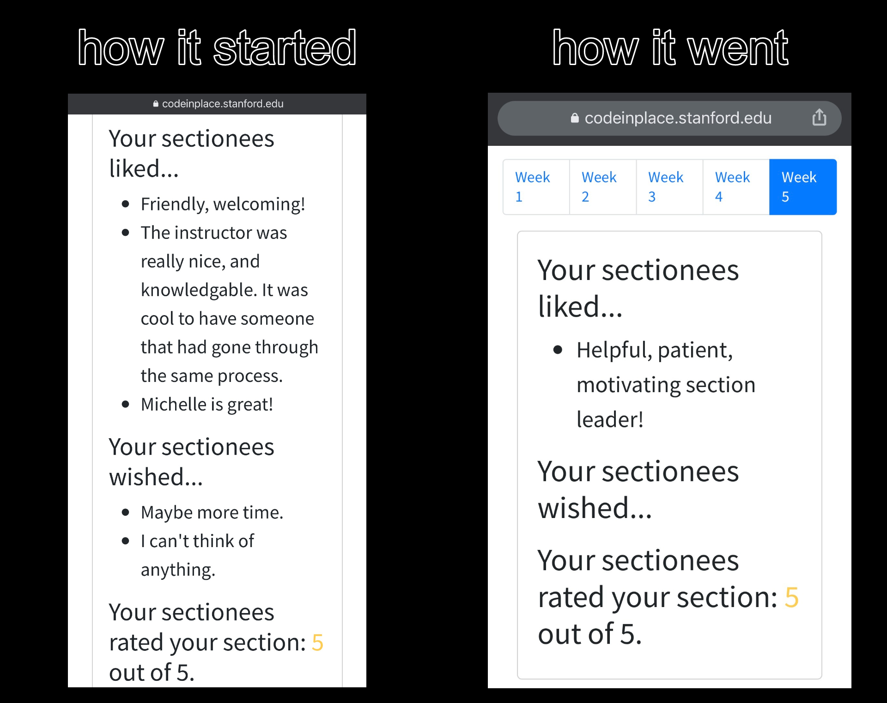
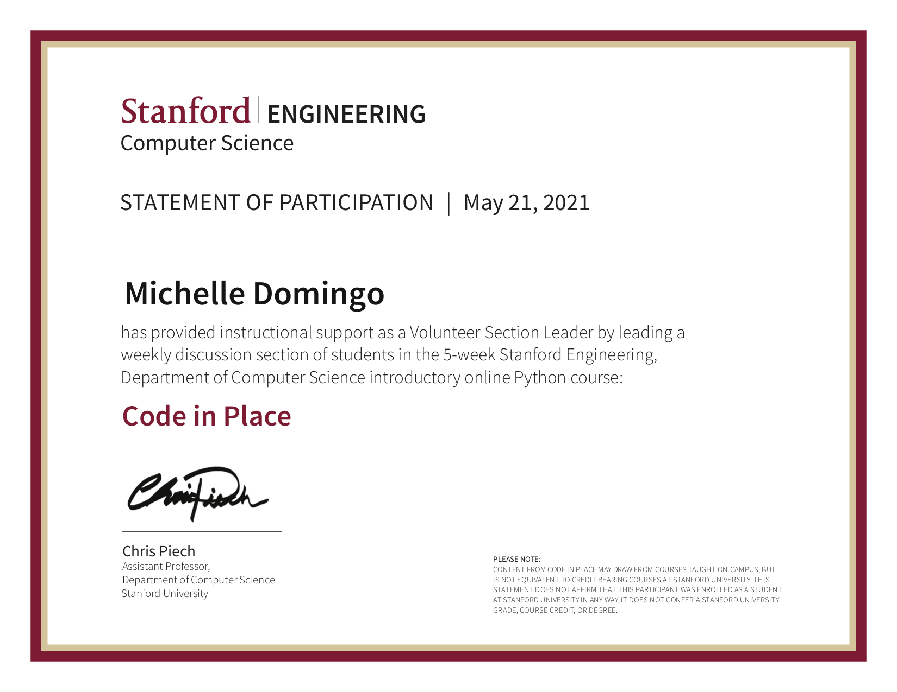
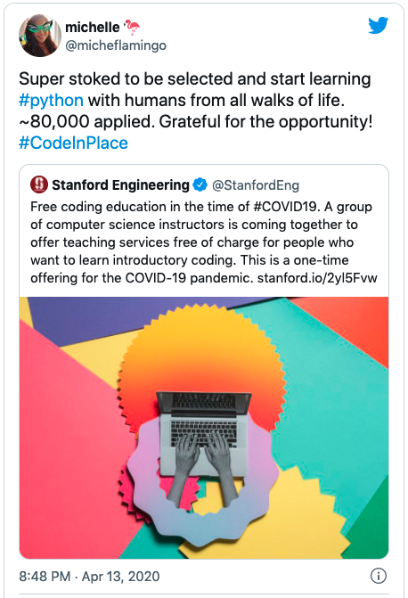

<h1 align="center">Volunteer Role: Section Leader, Code in Place 2021</h1>

Member of the teaching team for Code in Place, April - May 2021. This online course was offered by Stanford University during the COVID-19 pandemic. It brought together 12,000 students and 1100 volunteer teachers participating from around the world. The course is a 5-week introduction to Python programming using materials from the first half of Stanford’s CS106A course.
  
As a volunteer section leader, I prepared presentation slides and taught a weekly discussion section of 8-10 students to supplement professors' lectures. 

### Lesson Plan Slides:

- [Week 1 - Control flow, While loops, If statements, Decomposition](https://docs.google.com/presentation/d/e/2PACX-1vS_ILD5NLPhHYt61MQO0HV_rxMgrS-mMQz1SO6FvH-j056CebfFOGb64bUgQhZ7nu28p2eLW3d5Jj3d/pub?start=true&loop=false&delayms=3000)
- [Week 2 - Variables, Type Casting](https://docs.google.com/presentation/d/e/2PACX-1vS7lRCMbb-laWtnoIDeyo8m-4NWXtAQRstkXE9jzDo0y6kFdERv12MzuVY67ehshvd45WAw8HCR8C3R/pub?start=true&loop=false&delayms=3000)
- [Week 3 - Defining functions, Variable mechanics in a loop](https://docs.google.com/presentation/d/e/2PACX-1vSe7vuxGY9GXtrtt4nPq-THVAGfChz-lnQCkydBPuP24RxbLi7S_E30Ou8zQuouVW8dpwutbH_3d68g/pub?start=true&loop=false&delayms=3000)
- [Week 4 - Image Manipulation](https://docs.google.com/presentation/d/e/2PACX-1vQxw9aVekyVr9O6N5OUqZHF3W1HItMfVfB9xsmfXyVeVzxfaVDzXG2d3Q9YcB1yNbm9UKyq5QHYB8II/pub?start=true&loop=false&delayms=3000)
- [Week 5 - Lists & Files](https://docs.google.com/presentation/d/e/2PACX-1vRPhH5FoxwnHLWZFzA9V1vMhNhPzNoMlSDHWu3rsiCnMvwevJtHdR3ksUiuYEn4OTW8fx30p_04llo5/pub?start=true&loop=false&delayms=3000)

<strong>Statement of Participation</strong>

---

<h1 align="center">Student, Code in Place 2020</h1>
 
Participant in Stanford's first Code in Place (April - May 2020), with 10,000 global students and 900 volunteer teachers. Created a simple dictionary for the final project.

### Final Project links:

- [Showcase - a simple Dictionary](https://compedu.stanford.edu/codeinplace/public/projects/1326.html)

- [Code](./python-final_project-dictionary/dictionary.py)

 

---

## Author

[Michelle Domingo](https://github.com/michedomingo)
